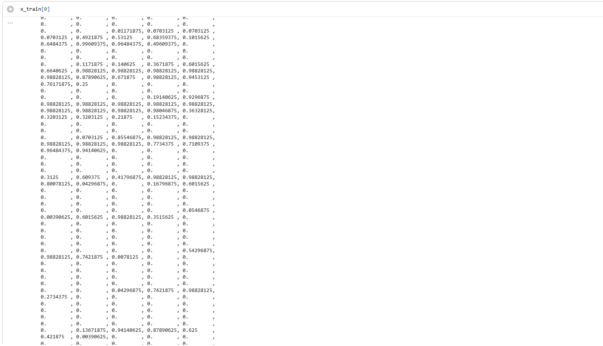
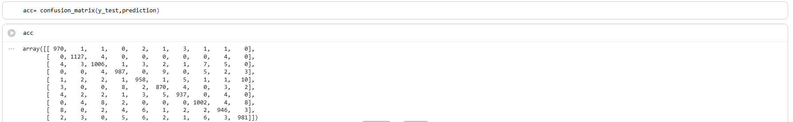
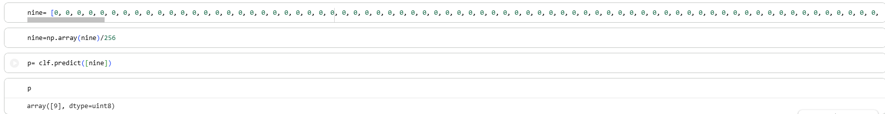

# 🧠 MNIST Digit Classifier

A machine learning project that recognizes handwritten digits (0–9) using a **Multi-Layer Perceptron (MLP)** trained on the **MNIST dataset**, achieving **97.84% test accuracy**. The project covers data preprocessing, neural network training, model evaluation, and prediction of handwritten digits.


---

## 📖 Overview

Handwritten digit recognition is a classic image classification problem in machine learning. In this project, an **MLP (Multi-Layer Perceptron)** is trained on the **MNIST dataset** to classify grayscale images of handwritten digits into one of ten classes (0–9).

The project demonstrates the complete machine learning workflow:

- Data loading
- Data preprocessing
- Model training
- Model evaluation
- Prediction on new samples

---

## ✨ Features

- 📚 Uses the MNIST handwritten digit dataset
- 🧹 Data preprocessing and normalization
- 🧠 Multi-Layer Perceptron (MLP) classifier
- 📊 Model evaluation
- 🔢 Predicts handwritten digits (0–9)
- 📓 Well-documented Jupyter Notebook implementation

---

## 📂 Project Structure

```text
mnist-digit-classifier/
│
├── notebooks/
│   └── mnist_digit_classifier.ipynb
│
├── images/
│   ├── confusion_matrix.png
│   ├── sample_digits.png
│   └── prediction.png
│
├── models/
│
├── README.md
├── requirements.txt
├── LICENSE
└── .gitignore
```

---

## 🛠️ Technologies Used

- Python
- NumPy
- Matplotlib
- TensorFlow / Keras
- Scikit-learn
- Jupyter Notebook

---

## 📊 Dataset

The project uses the **MNIST** handwritten digit dataset.

| Property | Value |
|----------|-------|
| Training Images | 60,000 |
| Test Images | 10,000 |
| Image Size | 28 × 28 pixels |
| Number of Classes | 10 |

---

## 🧠 Model

The classifier is based on a **Multi-Layer Perceptron (MLP)**.

### Workflow

```text
MNIST Images
      │
      ▼
Data Preprocessing
      │
      ▼
Normalization
      │
      ▼
Flatten (28×28 → 784)
      │
      ▼
MLP Classifier
      │
      ▼
Prediction (0–9)
```

---

## 🚀 Installation

Clone the repository:

```bash
git clone https://github.com/Mehul-Kumar-z2/mnist-digit-classifier.git
```

Move into the project folder:

```bash
cd mnist-digit-classifier
```

Install the required packages:

```bash
pip install -r requirements.txt
```

---

## ▶️ Usage

Launch Jupyter Notebook:

```bash
jupyter notebook
```

Open:

```text
notebooks/mnist_digit_classifier.ipynb
```

Run all cells to:

- Load the dataset
- Train the model
- Evaluate performance
- Predict handwritten digits

---

## 📈 Results

The trained Multi-Layer Perceptron (MLP) achieved the following performance on the MNIST test dataset:

| Metric | Value |
|--------|------:|
| Test Accuracy | **97.84%** |
| Dataset | MNIST |
| Number of Classes | 10 |

The model demonstrates strong performance in classifying handwritten digits, correctly recognizing the vast majority of test images.

---

### Key Highlights

- ✅ Test Accuracy: **97.84%**
- ✅ Successfully classifies handwritten digits (0–9)
- ✅ Trained using a Multi-Layer Perceptron (MLP)
- ✅ Built with Scikit-learn and TensorFlow's MNIST dataset

## 📸 Project Screenshots

### Sample MNIST Images



### Confusion Matrix



### Prediction Example



---

## 🔮 Future Improvements

- Implement a Convolutional Neural Network (CNN)
- Hyperparameter tuning
- Save and load trained models
- Streamlit web application
- Flask REST API
- Real-time digit recognition using a webcam
- Docker support

---

## 🤝 Contributing

Contributions, suggestions, and improvements are welcome.

1. Fork the repository
2. Create a new branch
3. Commit your changes
4. Open a Pull Request

---

## 📄 License

This project is licensed under the MIT License.

---

## 👨‍💻 Author

**Mehul Kumar**

Second-Year Undergraduate  
Department of Electrical Engineering  
Indian Institute of Technology Kanpur

- GitHub: https://github.com/Mehul-Kumar-z2
- LinkedIn: https://www.linkedin.com/in/mehul-kumar-78528536a

---

⭐ If you found this project useful, consider giving it a star!